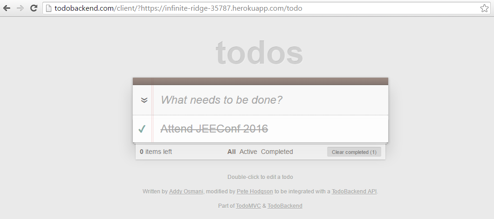

:example: example-07-heroku
:java: {example}/src/main/java

== Deploying to Heroku

Heroku is PaaS that allows you to deploy you applications quickly.
It's a great way to "get something" out there while quickly iterating.
You can prototype for free and once you're ready to "go live" you can pay for your usage.

To get started you'll need:

* A https://signup.heroku.com[Heroku account] (no credit card required)
* https://toolbelt.heroku.com/[Heroku toolbelt] -- command line binaries for working with Heroku

=== Setup

In order to deploy our application to Heroku we'll need two pieces of information.
When using Gradle, we need to provide a `stage` task.
Let's go over the changes we'll need to make to the Gradle build script.

[source, gradle]
.{example}/{example}.gradle
----
include::../{example}/{example}.gradle[tags=stage]
----
<1> I recommend using Shadow plugin for packaging your Java applications for production
<2> The Ratpack Gradle plugin applies `application` plugin, we need to declare our main entrypoint to the application
<3> We create a `stage` task that invokes `installShadowApp`

The second change we need to make is to add a file called `Procfile`.
This file is a signal that communicates to Heroku what command to invoke to start our application.

[source]
.{example}/Procfile
----
include::../{example}/Procfile[]
----

=== Creating and deploying the application to Heroku

[source, bash]
----
$  heroku apps:create # <1>
Creating app... done, stack is cedar-14
https://infinite-ridge-35787.herokuapp.com/ | https://git.heroku.com/infinite-ridge-35787.git

$ heroku git:remote --app infinite-ridge-35787  # <2>
set git remote heroku to https://git.heroku.com/infinite-ridge-35787.git

$ git remote -v # <3>
heroku  https://git.heroku.com/infinite-ridge-35787.git (fetch)
heroku  https://git.heroku.com/infinite-ridge-35787.git (push)

$ git push heroku master # <4>

$ heroku logs -t # <5>

$ curl https://infinite-ridge-35787.herokuapp.com/todo # <6>
[]
----
<1> Create a new application (Heroku will assign a random name if you don't)
<2> Add heroku git repository to our remotes
<3> View urls for the newly added git remote
<4> Push our code to the newly minted heroku remote repository
<5> Tail your application logs
<6> Curl against your application in the wild!

=== Final Product

With our application deployed and serving traffic, let's finish by running the TodoBackend specifications against our application.

You can navigate to the specification page to see the tests in action: http://todobackend.com/specs/?https://infinite-ridge-35787.herokuapp.com/todo

.TodoBackend Specs
image::images/todobackend-specs.PNG[]

You can similarly use our REST implementation against this sample Todo Frontend application.

http://todobackend.com/client/?https://infinite-ridge-35787.herokuapp.com/todo

.TodoBackend Client

